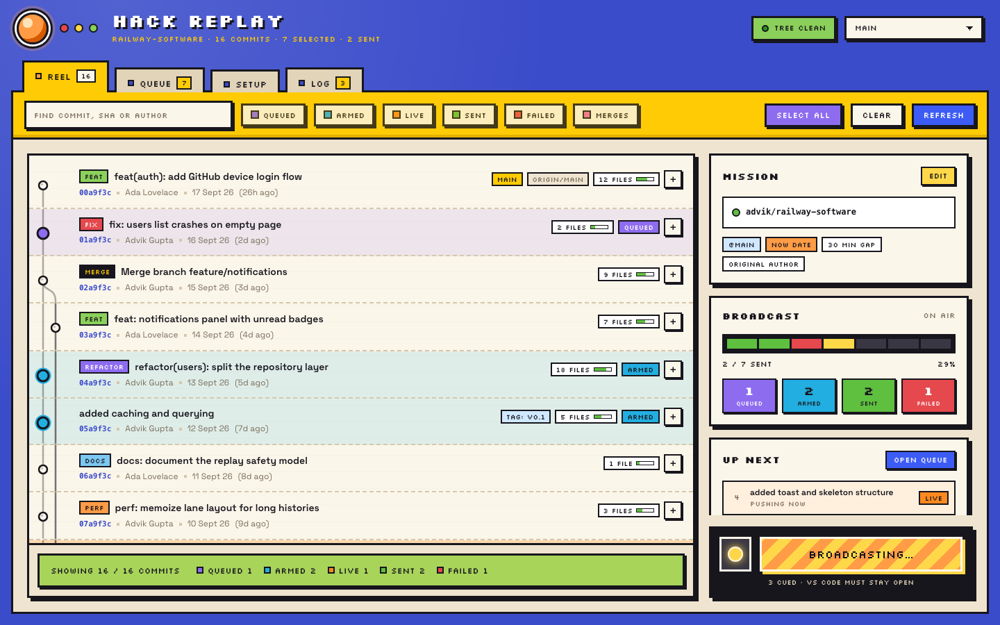
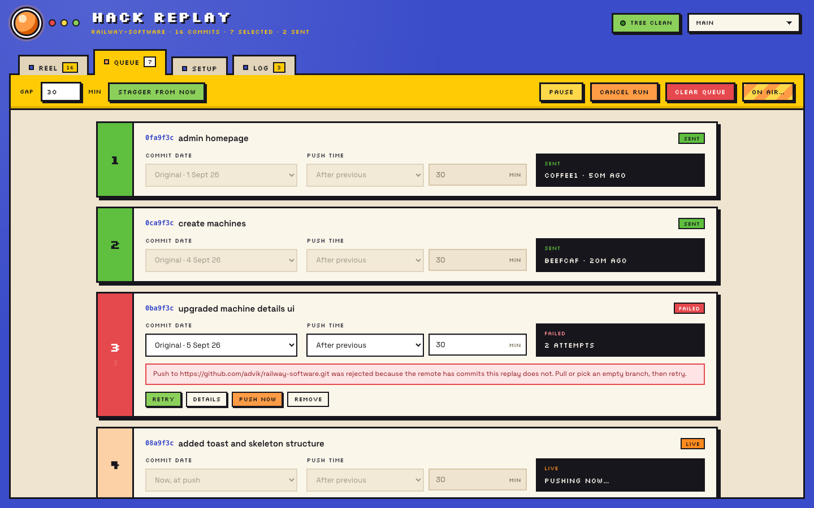
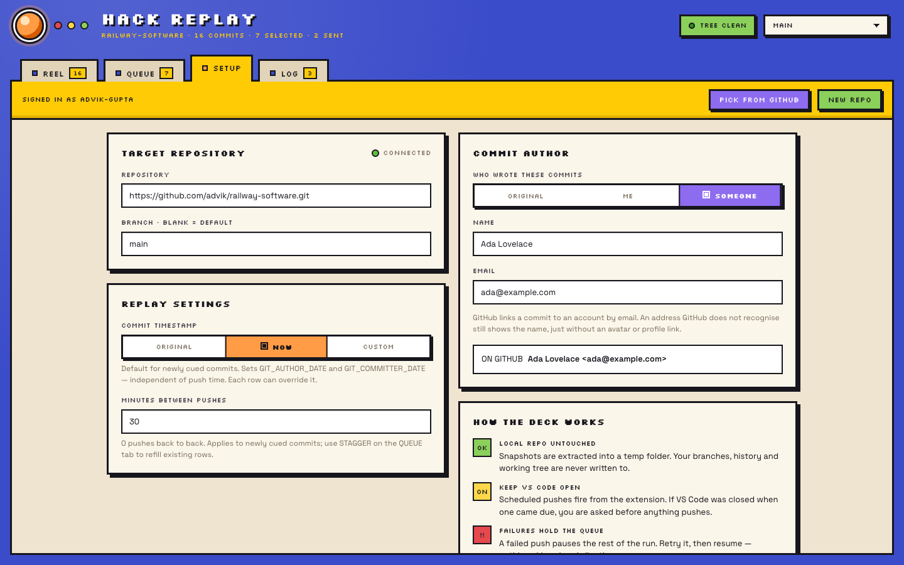
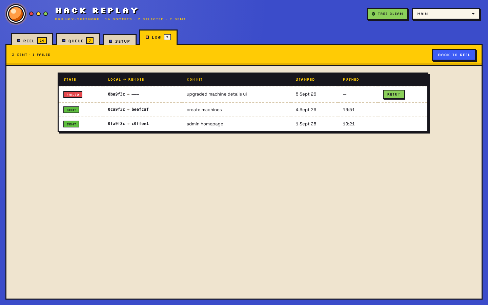

# Hack Replay

**Push an existing local git history to GitHub, commit by commit - keeping the dates and authors you choose, on a schedule you control.**

You built something locally over days or weeks. You have a real commit history: dozens of commits,
each with its own message, files and timestamp. You never pushed it. Now you want it on GitHub -
but `git push` on a brand-new remote either dumps everything at once, or you squash it all into a
single "initial commit" and the history you actually wrote disappears.

Hack Replay gives you the third option. It reads your local history, shows it as a graph, and lets
you pick commits and recreate each one on a GitHub repository as its own commit - with the
original message, the original files, and whatever author and timestamp you decide.

**Your local repository is never modified.** No rewriting, no rebasing, no branch changes, no
touching your working directory.

---

## Contents

- [How it works](#how-it-works)
- [Quick start](#quick-start)
- [Core concepts](#core-concepts)
- [The panel, tab by tab](#the-panel-tab-by-tab)
- [Scheduling in depth](#scheduling-in-depth)
- [Authorship and how GitHub reads it](#authorship-and-how-github-reads-it)
- [What it does to your machine](#what-it-does-to-your-machine)
- [Settings](#settings)
- [Commands](#commands)
- [Troubleshooting](#troubleshooting)
- [FAQ](#faq)
- [Using this responsibly](#using-this-responsibly)
- [Limitations](#limitations)
- [Development](#development)
- [License](#license)

---

## How it works

For every commit you select, Hack Replay:

1. **Extracts that commit's complete file tree** into a temporary folder - the files exactly as
   they existed at that commit, not a patch or a diff.
2. **Copies that snapshot into a temporary clone** of your target GitHub repository.
3. **Creates a commit** there with the original message, your chosen author, and your chosen
   timestamp.
4. **Pushes it**, either immediately or at a time you scheduled.
5. **Deletes the temporary folder.** On failure it keeps the folder so you can inspect it.

Because it replays _snapshots_ rather than patches, nothing can conflict and nothing can be applied
in the wrong order. A commit that deleted a file produces a commit that deletes that file, because
the snapshot simply doesn't contain it.



---

## Quick start

**Requirements:** VS Code 1.85+, `git` on your `PATH`, and a GitHub account with push access to
wherever you're sending commits.

1. **Open a folder that contains a git repository.** Hack Replay reads the repository at (or above)
   your workspace folder.
2. **Open the panel** - click the Hack Replay icon in the Activity Bar, or run
   **Hack Replay: Open** from the Command Palette (<kbd>Cmd/Ctrl</kbd>+<kbd>Shift</kbd>+<kbd>P</kbd>).
3. **Go to SETUP.** Sign in to GitHub, then either paste a repository (`owner/repo` or a full URL),
   pick one from your account, or create a new private one with **NEW REPO**.
4. **Choose your author and timestamp defaults** on the same tab. See
   [Authorship](#authorship-and-how-github-reads-it) - the defaults are sensible, but this is the
   part most people want to change.
5. **Go to REEL and click the commits you want.** Each click cues a commit. Shift-click selects a
   range. **SELECT ALL** takes everything.
6. **Go to QUEUE** to adjust individual commits - or skip it, since the defaults already apply.
7. **Press ON AIR.** Confirm the summary (it names the exact repository, branch, commit count and
   time window), and the run begins.

A first run against a throwaway repository is a good idea. Create one from the SETUP tab, replay a
handful of commits, and look at the result on GitHub before doing the real thing.

---

## Core concepts

### Selection is the queue

There is no separate "add to queue" step. Clicking a commit on the REEL puts it in the queue;
clicking it again takes it out. The right-hand rail updates as you click.

Commits that have already been pushed, failed, or are pushing right now stay in the queue as a
record of what happened, whether or not they're still selected.

### The six states

Every commit is in exactly one state, and the state is always written as a word, never just a
colour:

| State    | Meaning                                                                  |
| -------- | ------------------------------------------------------------------------ |
| `idle`   | In your history, not cued.                                               |
| `queued` | Cued, but no timer is running yet - nothing happens until you go on air. |
| `armed`  | A timer is running. This commit will push at a specific time.            |
| `live`   | Being pushed right now.                                                  |
| `sent`   | Successfully pushed. The log records the SHA it became on the remote.    |
| `failed` | The push failed. It can be retried, and the run is paused.               |

### Two independent clocks

This is the central idea of the tool, and the part worth understanding before your first run.
Every commit has **two separate time settings**:

| Setting              | Question it answers                           | Options                                                                                    |
| -------------------- | --------------------------------------------- | ------------------------------------------------------------------------------------------ |
| **Commit timestamp** | What date will this commit _say_ it was made? | its **original** date · the moment it's **pushed** · a **custom** date you pick            |
| **Push time**        | When does `git push` actually run?            | **immediately** · a number of minutes **after the previous push** · at a **specific time** |

They are deliberately unlinked. You can push a commit at 3:15 PM today and have it carry a
timestamp from three weeks ago. Or push commits over the next four hours while all of them carry
today's date. Set them on the QUEUE tab, per commit.

---

## The panel, tab by tab

### REEL - your history

A vertical commit graph, newest first, with lanes and connectors for branches and merges. Each row
shows:

- a **type badge** (`FEAT`, `FIX`, `REFACTOR`, `MERGE`…) read from a conventional-commit prefix
  such as `feat:` or `fix(ui):`, when the message has one;
- the commit subject, short SHA, author and date;
- a **file count** with a small bar showing relative size;
- branch and tag labels;
- the commit's current state, once it's cued.

Click a row to cue it. Click the **`+`** button on the right to expand it and see the full SHA,
parents, the complete message, and every file changed with added/removed line counts.

The toolbar has a search box (message, SHA or author) and filter chips for each state plus merges.
Filtering only hides rows - the graph's lane layout is always computed from your full history, so
what you see stays accurate.

The green bar at the bottom summarises what's showing and how many commits sit in each state.

### QUEUE - timing



One wide card per cued commit, numbered in the order they'll be pushed and colour-coded by state.
Each card sets that commit's **commit date** and **push time** independently, and shows a live
countdown of when it will fire.

- **Drag cards** by the handle to reorder them. Reordering shifts only relative push times; a
  commit pinned to a specific clock time keeps that time.
- **STAGGER FROM NOW** fills push times across the whole queue using the gap in the toolbar - the
  fastest way to spread a large run out.
- **PAUSE** stops the timers without losing the queue. **CANCEL RUN** stands everything down.
  **CLEAR QUEUE** empties it entirely.
- Failed cards offer **RETRY**, **DETAILS** (the full git error) and **OPEN TEMP FOLDER**.

### SETUP - target, author and defaults



- **TARGET REPOSITORY** - where commits are sent. Accepts `owner/repo`, an HTTPS URL or an SSH-style
  URL. The indicator turns green when the repository is reachable with your account, red when it
  isn't. Leave the branch blank to use the remote's default.
- **REPLAY SETTINGS** - the default commit timestamp and the default gap between pushes, applied to
  newly cued commits. Individual commits can always override these on the QUEUE tab.
- **COMMIT AUTHOR** - who the commits belong to. See the next section.
- **HOW THE DECK WORKS** - a short summary of the safety rules and a key to the six states.

### LOG - what actually happened



Every commit that landed or failed, newest first, with the local SHA, the SHA it became on the
remote, the date it was stamped with, and when it was pushed. Failed rows can be retried here.

---

## Scheduling in depth

### Push time modes

- **Immediately** - pushes as soon as the run reaches this commit.
- **After previous** - waits _N_ minutes after the previous commit's push. This is the default, and
  what makes a history arrive gradually.
- **At a set time** - an exact date and time you pick. Useful for "this one goes out tomorrow
  morning."

The first commit in the queue has nothing to be relative to, so it always starts the run
immediately. Its relative offset is ignored rather than rewritten, which means dragging it out of
first place restores the gap it had.

Pushes always run **one at a time, in queue order**. Two commits that come due simultaneously will
not race each other.

### When a run is interrupted

Scheduled pushes are timers inside VS Code, **not** a background service. The queue is saved to
disk every time it changes, with absolute timestamps, so:

- **Reloading the window or restarting VS Code** restores the queue and re-arms the timers.
- **If pushes came due while VS Code was closed,** Hack Replay does _not_ fire them silently. On
  the next launch it tells you how many were missed and offers to replay them now, reschedule them
  from now, or leave everything paused.
- **If VS Code closed mid-push,** that commit is marked `failed` with an explanation, because it
  can't know whether the push completed. Check the remote before retrying it.
- **Very long waits are handled.** A single timer can't span more than ~24 days, so longer
  schedules are chained across multiple timers.

While anything is armed or pushing, the status bar shows it (for example `Hack Replay: 2 armed`),
so background git activity is never invisible.

### When a push fails

A failed push **stops the run** rather than pushing on regardless - replaying the rest of a history
on top of a broken commit usually makes things worse. The failing commit is marked `failed` with
the reason, the run pauses, and you resume explicitly after fixing it.

The local commit created for a failed push is rolled back inside the temporary clone, so a retry
can't produce duplicates.

---

## Authorship and how GitHub reads it

Set once on the SETUP tab, applied to every commit in the run:

| Option       | Result                                                                                     |
| ------------ | ------------------------------------------------------------------------------------------ |
| **ORIGINAL** | Each commit keeps the author name and email it already has in your local history.          |
| **ME**       | Every commit is authored by your own git identity (`git config user.name` / `user.email`). |
| **SOMEONE**  | Every commit is authored by a name and email you type.                                     |

**Author and committer are always set to the same person.** Git records two identities per commit,
and when they differ GitHub shows both ("A and B"). Hack Replay sets both, so a commit shows one
name - never the name of this tool.

**GitHub matches commits to accounts by email address.** If the email belongs to a GitHub account,
the commit links to that profile and shows their avatar. If it doesn't, the commit still shows the
name you set, just without a profile link. This also determines whether a commit appears on
someone's contribution graph - along with GitHub's own rules, which require the commit to be on the
repository's default branch and the email to be verified on the account.

**SOMEONE** needs both a name and a valid email. An incomplete entry is flagged in the card, blocks
the ON AIR button, and is refused by the replay engine, so a run can't start and then fail halfway.

---

## What it does to your machine

### Your repository is read-only

Hack Replay never writes to your repository's history, branches or working directory. To read a
commit's files it adds a detached `git worktree` in a temporary directory and removes it
immediately afterwards; if that isn't possible it falls back to `git archive`. Everything else -
the clone of the target, the staging, the commit - happens inside a temporary folder under your
system temp directory, which is deleted when the run finishes.

The header's **TREE CLEAN / TREE DIRTY** indicator is there as a reminder: uncommitted changes in
your working directory are never included in a replay, because only committed snapshots are ever
read.

Files ignored by the source commit's `.gitignore` are never pushed either.

### Credentials

Authentication uses VS Code's built-in GitHub sign-in (`vscode.authentication`). There is no
personal access token to create or paste. The access token is requested per operation, held in
memory, passed to a single git command, and **never written into `.git/config`** or any file on
disk. Credentials are stripped from anything shown in the UI or written to the output channel.

### Data and telemetry

Hack Replay collects nothing and sends nothing anywhere. It talks to exactly two places: the GitHub
API (to list repositories and check your target), and your target repository over HTTPS (to push).
Your queue and preferences are stored locally by VS Code.

---

## Settings

| Setting                            | Default    | Description                                                                                                                 |
| ---------------------------------- | ---------- | --------------------------------------------------------------------------------------------------------------------------- |
| `hackReplay.maxCommits`            | `500`      | How many commits to read from history. Raise it for very long histories; the graph stays responsive into the low thousands. |
| `hackReplay.defaultCommitDateMode` | `now`      | Default timestamp for newly cued commits: `original`, `now`, or `custom`.                                                   |
| `hackReplay.authorMode`            | `original` | Who commits are authored by: `original`, `self`, or `custom`.                                                               |
| `hackReplay.customAuthorName`      | `""`       | Author name used when `authorMode` is `custom`.                                                                             |
| `hackReplay.customAuthorEmail`     | `""`       | Author email used when `authorMode` is `custom`.                                                                            |
| `hackReplay.defaultStaggerMinutes` | `30`       | Minutes between pushes for newly cued commits. `0` pushes back to back.                                                     |
| `hackReplay.keepTempOnFailure`     | `true`     | Keep the temporary folder after a failed push so it can be inspected.                                                       |
| `hackReplay.targetBranch`          | `""`       | Branch to push to. Empty uses the remote's default branch.                                                                  |

---

## Commands

| Command                                  | What it does                                                               |
| ---------------------------------------- | -------------------------------------------------------------------------- |
| **Hack Replay: Open**                    | Opens the panel.                                                           |
| **Hack Replay: Cancel Scheduled Pushes** | Stands down everything waiting, without touching what's already been sent. |
| **Hack Replay: Show Queue Status**       | Reveals the panel; also what the status bar item opens.                    |

---

## Troubleshooting

**"No git repository found in this workspace."**
Open a folder that is (or is inside) a git repository. Hack Replay searches upward from each
workspace folder for a `.git` directory.

**"git was not found on your PATH."**
Install git, or make sure the `git` command works in a fresh terminal, then reload VS Code.

**The push was rejected because the remote has commits this replay does not.**
The target branch has moved ahead of the clone Hack Replay made. Push to an empty repository or a
fresh branch, or bring the target up to date, then retry the failed commit.

**"TARGET UNREACHABLE".**
The repository doesn't exist under that name, or your signed-in account can't push to it. Check
spelling and access. For an organisation repository, confirm you have write permission.

**GitHub rejected the push / authentication failed.**
Sign out and back in from the SETUP tab so VS Code issues a fresh token with the `repo` scope. If
your organisation enforces SSO, authorise the token for that organisation.

**"No git identity is configured."**
You chose **ME** as the author but have no `user.name` / `user.email` set. Either configure them
(`git config --global user.name "…"`) or choose a different author mode.

**A scheduled push didn't fire.**
VS Code was closed or the window was reloaded at the moment it came due. Reopen VS Code - you'll be
asked whether to replay the missed pushes, reschedule them, or leave them paused.

**Something failed and I want to see why.**
Use **DETAILS** on the failed card for the full git error, **OPEN TEMP FOLDER** to inspect the
working state that produced it, or open the **Hack Replay** output channel
(View → Output → Hack Replay) for a log of every operation.

---

## FAQ

**Does this rewrite or damage my local history?**
No. Your repository is only ever read from. All work happens in a temporary clone.

**Are these "fake" commits?**
The content is real: each replayed commit carries the exact files, message and (optionally) date
and author of a commit you actually made. What's new is the commit object itself, because a commit
created on a different remote at a different time is necessarily a different object. If you keep
the original dates and authors, the result is a faithful copy of your history.

**Will the commits show up on my GitHub contribution graph?**
That's GitHub's decision, not this extension's. GitHub counts a commit when its email matches a
verified email on your account and the commit is on the repository's default branch, among other
rules it can change at any time. Hack Replay's job is to set the dates and identity you asked for.

**Can I replay into a repository that already has commits?**
Yes. New commits are added on top of the target branch. If the branch moves ahead of Hack Replay's
clone mid-run, the push is rejected and the run pauses.

**What happens to merge commits?**
They're replayed as ordinary single-parent commits carrying the merged snapshot. The graph still
draws them properly and tags them `MERGE`.

**Can I replay the same commits twice?**
Yes, and you'll get a second set of commits on the remote. Hack Replay doesn't deduplicate against
the target.

**Does it handle submodules or Git LFS?**
Not specially. Submodules are replayed as the gitlink entries they are in the snapshot, and LFS
pointer files are replayed as files. Neither has been extensively tested.

**Does it work with GitLab, Bitbucket or a self-hosted remote?**
Pushing uses plain HTTPS git and may work, but sign-in and the repository picker are GitHub-only,
and the tool is only tested against GitHub.

---

## Using this responsibly

Hack Replay writes whatever author and date you tell it to. That's the point - it exists so that
history you genuinely wrote can reach GitHub looking the way it actually happened.

The same capability can be used to misrepresent things: to claim work you didn't do, to attribute
commits to someone who didn't write them, or to manufacture activity that never occurred. Please
don't. Commit metadata is used by real people to evaluate real contributions.

---

## Limitations

- **Merge commits become single-parent commits.** Preserving multi-parent structure would mean
  mapping every original parent to its replayed counterpart and rebuilding the merge; that isn't
  implemented.
- **Pushes go to one branch per run.** Branch topology isn't recreated on the remote.
- **Tags aren't replayed.**
- **Scheduled pushes require VS Code to be running.** There's no daemon.
- **Not a general git client.** It visualises history and replays commits; that's all.

---

## Development

```bash
npm install
npm run build      # bundle extension + webview
npm run watch      # rebuild on save
npm run check      # type check
npm run package    # produce a .vsix
```

Press <kbd>F5</kbd> to launch an Extension Development Host, then run **Hack Replay: Open**.

### Layout

```
src/
  extension.ts       activation, commands, status bar, missed-push recovery
  types.ts           shared types and the webview message protocol
  git/
    readHistory.ts   git log and per-commit file lists (read-only)
    replayCommit.ts  snapshot extraction, commit creation, push
    queue.ts         scheduling, persistence, sequential execution
  auth/github.ts     VS Code GitHub session and REST calls
  webview/panel.ts   panel lifecycle and message routing
media/webview/       panel UI (main.ts, styles.css) - no framework
```

### Architecture

All git and network work happens in the extension host. The webview renders and posts typed
messages; it never runs git. The message protocol is the `ToHostMessage` / `ToWebviewMessage`
unions in `src/types.ts`, and adding a feature usually means adding a case to both sides.

The scheduler is the only stateful piece: it owns the queue, persists it to `globalState` on every
change, and is the single place timers are created or cleared.

Two constraints to know before editing the UI:

- **The webview's content security policy has no `unsafe-inline` for styles.** A `style` attribute
  written into markup is silently dropped; styles set from script must go through
  `element.style.setProperty`.
- **Nothing uses `innerHTML`.** Commit messages, author names and file paths reach the DOM as text
  nodes, so they cannot inject markup.

---

## License

MIT - see [LICENSE.md](LICENSE.md).
